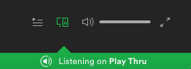
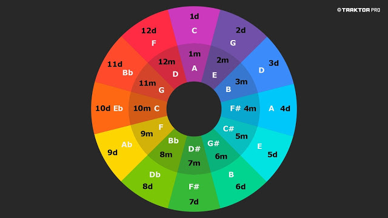

# PlayThru

[](https://travis-ci.org/jackbittiner/play-thru)

It's the bane of all amateur DJs when you try to mix two songs together (which you think would work together really well) but then it sounds just awful. And what's the reason for this? They're just not musically compatible.

This app is trying to solve that problem. It will recommend songs to you in a similar tempo and in the same, or harmonic, key.

It is currently a work in progress.

Play with it here: [PlayThru](https://play-thru.herokuapp.com/)

### Usage

#### Prerequisites

Acess to a spotify premium account

#### Instructions

1.  Login to Spotify via Play Thru
2.  Ensure spotify is connected to the Play Thru app (see image below)
3.  Select a song using Play Thru and it will play the song and make suggestions on the next song



# Contributing

## Open Tasks

Can be found [here](https://github.com/jackbittiner/play-thru/projects/1)

## Run the Project

#### Prerequesites

`node v10.13.0`

#### Instructions

Clone the repository

```
git clone git@github.com:jackbittiner/play-thru.git
```

Install all dependencies

```
yarn install
```

Start all packages

```
yarn start
```

## Run the Tests

```
yarn test
```

## Travis Pipeline

https://travis-ci.org/jackbittiner/play-thru

# How does it work?

We use the spotify API to get the track features for a song. The most important information we use is the tempo, the key and the mode.

- Tempo is the speed of the track in beats per minute (BPM)
- Key is the group of pitches and scale of the composition. Integers represent each key. For example C = 0, C# = 1, D = 2 etc.
- Mode is whether it is in the minor or Major key. 1 = Major. 0 = Minor

We then ask Spotify for a list of recommendations based on this information.

This is where the Camelot Wheel comes in.

## The Camelot Wheel



Now what is going on here?

- Each number represents a key as stated above.
- The outside of the wheel represents the Major mode and the inside of the wheel represents the Minor mode.
- A track's key is considered compatible with another if it's positioned next to it or opposite it.
- For example the key of C (1d) is compatible with F (12d), G (2d) and Am (1m)

We use these rules to request recommendations from Spotify in these keys (and in a similar tempo to the track, of course)

## What's left to come

- Have a search functionalilty for when you first go on the app.

- Play the new song at the beginning of a section, at the end of the next section of the current song. (This makes sense in my head)

- Then I think a lick of paint wouldn't go amiss.

- And some UI tests would be nice too.

- Submit to spotify devloper showcase.

If you would like to follow the progress in more detail, the project board can be found [here](https://github.com/jackbittiner/play-thru/projects/1)
